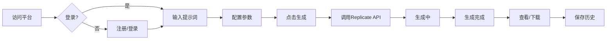

## 1. Product Overview
基于Replicate API和Nano Banana模型的商业级AI图像生成平台，提供高效、高质量的图像生成服务。
- 核心目标：让用户通过简单的文字描述生成专业级图像
- 目标用户：设计师、营销人员、内容创作者、开发者

## 2. Core Features

### 2.1 User Roles
| Role | Registration Method | Core Permissions |
|------|---------------------|------------------|
| 普通用户 | Email/Social | 生成图像、查看历史、管理账户 |
| 管理员 | 后台配置 | 管理用户、监控系统、配置模型 |

### 2.2 Feature Module
1. **首页**: Hero区域、快速生成、热门模板、价格方案
2. **图像生成页**: 提示词编辑器、参数调节、实时预览、生成历史
3. **用户中心**: 账户管理、API密钥、生成额度、历史记录

### 2.3 Page Details
| Page Name | Module Name | Feature description |
|-----------|-------------|---------------------|
| 首页 | Hero section | 品牌展示、CTA按钮、产品特性介绍 |
| 首页 | Quick Generate | 一键生成体验、示例展示 |
| 首页 | Templates | 预设模板分类、快速选用 |
| 首页 | Pricing | 套餐对比、订阅入口 |
| 生成页 | Prompt Editor | 智能提示词输入、历史记录、预设模板 |
| 生成页 | Parameters | 分辨率选择、质量设置、风格调节 |
| 生成页 | Preview | 实时生成状态、加载动画、结果展示 |
| 用户中心 | Account | 个人信息、密码修改、头像上传 |
| 用户中心 | API Keys | 生成/管理API密钥、使用统计 |
| 用户中心 | Credits | 余额显示、充值入口、消费记录 |
| 用户中心 | History | 生成历史列表、图片下载、重新生成 |

## 3. Core Process

用户访问平台 → 注册/登录 → 输入提示词 → 配置参数 → 点击生成 → 等待生成 → 查看/下载结果 → 保存到历史

## 4. User Interface Design

### 4.1 Design Style
- **主色调**: 深邃的靛蓝色 (#1e1b4b) 搭配霓虹青色 (#06b6d4) 和紫色 (#8b5cf6)
- **按钮风格**: 渐变背景、圆角、悬停发光效果
- **字体**: 标题使用 'Orbitron' 科技感字体，正文使用 'Inter'
- **布局**: 深色主题、卡片式设计、玻璃拟态效果
- **动效**: 平滑过渡、生成时的脉冲动画、结果展示的缩放效果

### 4.2 Page Design Overview

#### 首页
| Module | UI Elements |
|--------|-------------|
| Hero | 大标题、副标题、CTA按钮、背景动画、品牌Logo |
| Quick Generate | 简洁输入框、生成按钮、示例图片瀑布流 |
| Templates | 分类标签、模板卡片网格、悬停预览 |
| Pricing | 三列卡片对比、功能清单、高亮推荐 |

#### 生成页
| Module | UI Elements |
|--------|-------------|
| Prompt Editor | 多行文本输入、字数统计、预设标签、历史下拉 |
| Parameters | 滑块控制、下拉选择、实时预览参数值 |
| Preview | 加载动画、进度条、生成结果展示、下载按钮 |

#### 用户中心
| Module | UI Elements |
|--------|-------------|
| Account | 表单输入、头像上传、保存按钮 |
| API Keys | 密钥列表、生成/删除按钮、复制功能 |
| Credits | 余额显示、充值按钮、消费记录表格 |
| History | 时间线布局、缩略图、操作按钮 |

### 4.3 Responsiveness
- 桌面端优先设计
- 平板端自适应布局
- 移动端简化界面、底部导航

### 4.4 3D Scene Guidance
- 首页Hero区域可添加抽象3D粒子效果
- 生成过程展示动态网格背景
- 结果展示使用卡片悬浮效果
