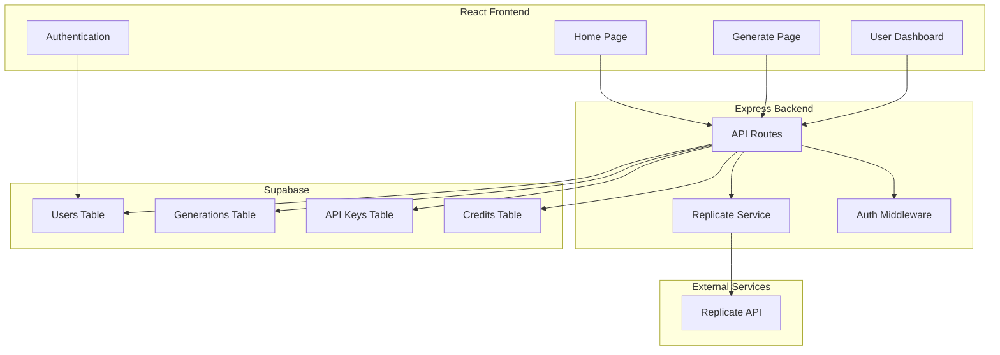
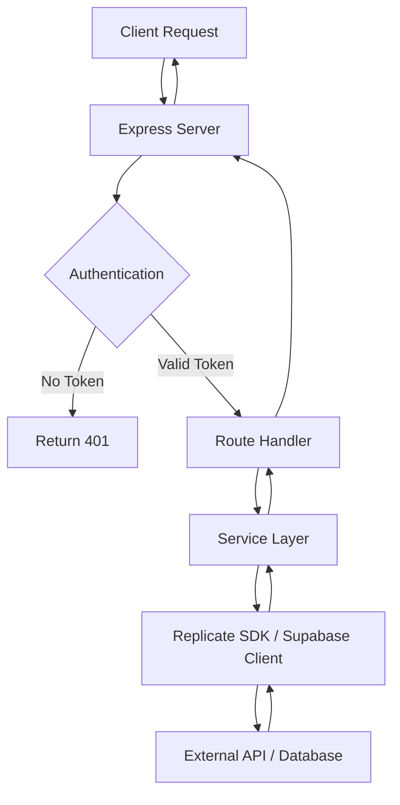
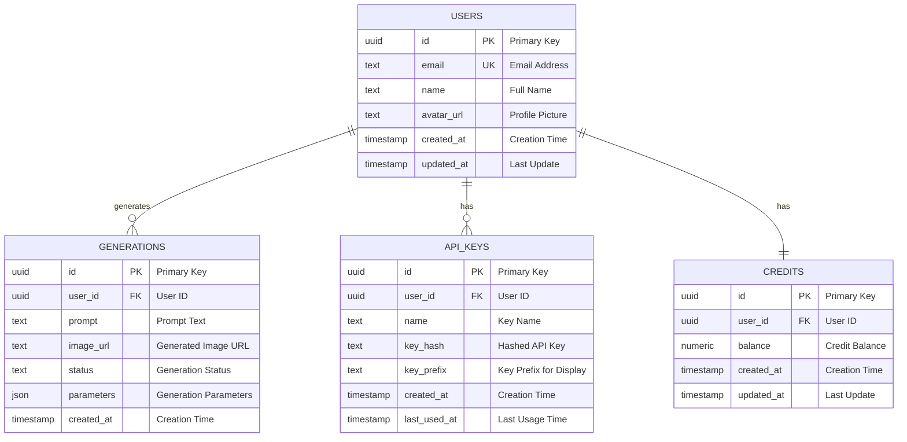

## 1. Architecture Design



## 2. Technology Description

| Layer | Technology | Version |
|-------|------------|---------|
| Frontend | React | 18.x |
| Frontend | TypeScript | 5.x |
| Frontend | Tailwind CSS | 3.x |
| Frontend | Vite | 6.x |
| Frontend | React Router | 6.x |
| Frontend | Zustand | 4.x |
| Frontend | Lucide React | Latest |
| Backend | Express | 4.x |
| Backend | TypeScript | 5.x |
| Backend | Replicate SDK | Latest |
| Database | Supabase (PostgreSQL) | Latest |
| Auth | Supabase Auth | Latest |

## 3. Route Definitions

### Frontend Routes
| Route | Purpose | Component |
|-------|---------|-----------|
| / | 首页 | Home |
| /generate | 图像生成页 | Generate |
| /dashboard | 用户中心 | Dashboard |
| /dashboard/account | 账户设置 | Account |
| /dashboard/api-keys | API密钥管理 | APIKeys |
| /dashboard/credits | 额度管理 | Credits |
| /dashboard/history | 生成历史 | History |
| /login | 登录页 | Login |
| /register | 注册页 | Register |

### Backend API Routes
| Route | Method | Purpose | Auth Required |
|-------|--------|---------|---------------|
| /api/generate | POST | 调用Replicate生成图像 | Yes |
| /api/generate/status | GET | 查询生成状态 | Yes |
| /api/generations | GET | 获取用户生成历史 | Yes |
| /api/generations/:id | DELETE | 删除生成记录 | Yes |
| /api/api-keys | GET | 获取API密钥列表 | Yes |
| /api/api-keys | POST | 生成新API密钥 | Yes |
| /api/api-keys/:id | DELETE | 删除API密钥 | Yes |
| /api/credits | GET | 获取用户额度 | Yes |
| /api/user | GET | 获取用户信息 | Yes |
| /api/user | PUT | 更新用户信息 | Yes |

## 4. API Definitions

### Generate Image
**POST** `/api/generate`

Request Body:
```typescript
interface GenerateRequest {
  prompt: string;
  width?: number;
  height?: number;
  num_outputs?: number;
  guidance_scale?: number;
  num_inference_steps?: number;
  seed?: number;
}
```

Response:
```typescript
interface GenerateResponse {
  id: string;
  status: 'starting' | 'processing' | 'succeeded' | 'failed';
  output?: string[];
  error?: string;
}
```

### Get Generation Status
**GET** `/api/generate/status?id=string`

Response:
```typescript
interface GenerationStatus {
  id: string;
  status: 'starting' | 'processing' | 'succeeded' | 'failed';
  output?: string[];
  error?: string;
  created_at: string;
}
```

### Get Generations History
**GET** `/api/generations?page=number&limit=number`

Response:
```typescript
interface Generation {
  id: string;
  prompt: string;
  image_url: string;
  status: string;
  created_at: string;
}

interface GenerationsResponse {
  data: Generation[];
  total: number;
  page: number;
  limit: number;
}
```

### API Keys
**POST** `/api/api-keys`

Request Body:
```typescript
interface CreateAPIKeyRequest {
  name: string;
}
```

Response:
```typescript
interface APIKey {
  id: string;
  name: string;
  key: string;
  created_at: string;
  last_used_at?: string;
}
```

## 5. Server Architecture Diagram



## 6. Data Model

### 6.1 Data Model Definition



### 6.2 Data Definition Language

```sql
-- Users Table
CREATE TABLE users (
    id UUID PRIMARY KEY DEFAULT gen_random_uuid(),
    email TEXT UNIQUE NOT NULL,
    name TEXT,
    avatar_url TEXT,
    created_at TIMESTAMP WITH TIME ZONE DEFAULT NOW(),
    updated_at TIMESTAMP WITH TIME ZONE DEFAULT NOW()
);

-- Generations Table
CREATE TABLE generations (
    id UUID PRIMARY KEY DEFAULT gen_random_uuid(),
    user_id UUID REFERENCES users(id) ON DELETE CASCADE,
    prompt TEXT NOT NULL,
    image_url TEXT,
    status TEXT DEFAULT 'pending',
    parameters JSONB,
    created_at TIMESTAMP WITH TIME ZONE DEFAULT NOW()
);

-- API Keys Table
CREATE TABLE api_keys (
    id UUID PRIMARY KEY DEFAULT gen_random_uuid(),
    user_id UUID REFERENCES users(id) ON DELETE CASCADE,
    name TEXT NOT NULL,
    key_hash TEXT NOT NULL,
    key_prefix TEXT NOT NULL,
    created_at TIMESTAMP WITH TIME ZONE DEFAULT NOW(),
    last_used_at TIMESTAMP WITH TIME ZONE
);

-- Credits Table
CREATE TABLE credits (
    id UUID PRIMARY KEY DEFAULT gen_random_uuid(),
    user_id UUID REFERENCES users(id) ON DELETE CASCADE UNIQUE,
    balance NUMERIC DEFAULT 0,
    created_at TIMESTAMP WITH TIME ZONE DEFAULT NOW(),
    updated_at TIMESTAMP WITH TIME ZONE DEFAULT NOW()
);

-- Indexes
CREATE INDEX idx_generations_user_id ON generations(user_id);
CREATE INDEX idx_api_keys_user_id ON api_keys(user_id);
CREATE INDEX idx_credits_user_id ON credits(user_id);
```

### 6.3 Supabase RLS Policies

```sql
-- Users Table Policies
CREATE POLICY "Users can view their own profile" ON users
    FOR SELECT USING (auth.uid() = id);

CREATE POLICY "Users can update their own profile" ON users
    FOR UPDATE USING (auth.uid() = id) WITH CHECK (auth.uid() = id);

-- Generations Table Policies
CREATE POLICY "Users can view their own generations" ON generations
    FOR SELECT USING (auth.uid() = user_id);

CREATE POLICY "Users can insert their own generations" ON generations
    FOR INSERT WITH CHECK (auth.uid() = user_id);

CREATE POLICY "Users can delete their own generations" ON generations
    FOR DELETE USING (auth.uid() = user_id);

-- API Keys Table Policies
CREATE POLICY "Users can view their own API keys" ON api_keys
    FOR SELECT USING (auth.uid() = user_id);

CREATE POLICY "Users can insert their own API keys" ON api_keys
    FOR INSERT WITH CHECK (auth.uid() = user_id);

CREATE POLICY "Users can delete their own API keys" ON api_keys
    FOR DELETE USING (auth.uid() = user_id);

-- Credits Table Policies
CREATE POLICY "Users can view their own credits" ON credits
    FOR SELECT USING (auth.uid() = user_id);

CREATE POLICY "Users can update their own credits" ON credits
    FOR UPDATE USING (auth.uid() = user_id) WITH CHECK (auth.uid() = user_id);

-- Grant Permissions
GRANT SELECT ON users TO anon, authenticated;
GRANT ALL PRIVILEGES ON users TO authenticated;

GRANT SELECT ON generations TO anon, authenticated;
GRANT ALL PRIVILEGES ON generations TO authenticated;

GRANT SELECT ON api_keys TO anon, authenticated;
GRANT ALL PRIVILEGES ON api_keys TO authenticated;

GRANT SELECT ON credits TO anon, authenticated;
GRANT ALL PRIVILEGES ON credits TO authenticated;
```
